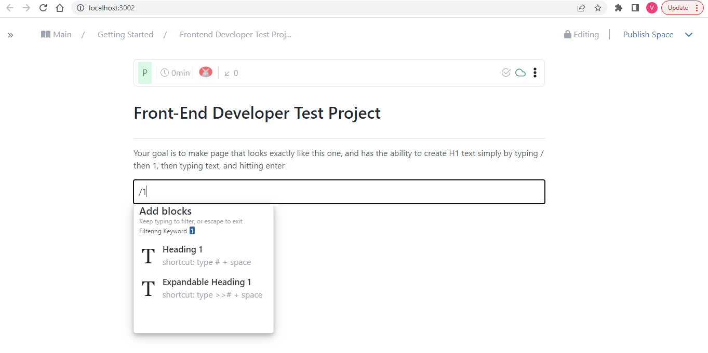

#FrontEnd Test Project

This is a page that changes a text to a h1 element by simply typing / followed by 1.

## Screenshot



## Built With

- React
- Bootstrap
- Fontawesome
- CSS
- Jest
- React-Icons

## Live demo

You can visit live version via [Live](https://thunderous-panda-922468.netlify.app/).

## Getting Started

To get a local copy up and running follow these simple example steps:
- Open Terminal.
- Change the current working directory to the location you want the cloned directory.
- Enter the following:
```
$ git clone https://github.com/Adanzeakonobi/Frontend-test.git
```
- Press Enter to create your local clone.
- Navigate to the cloned repository by running:
```
$ cd Frontend-test
```
- Install all dependencies using:
``` 
$ npm install
```
- Run local server using:
``` 
$ npm start
```

### Prerequisites
- GitHub
- Git
- React


## Authors
👤 **Adaobi Vivian Okoye**

- GitHub: [@githubhandle](https://github.com/adanzeakonobi) 
- Twitter: [@twitterhandle](https://twitter.com/Adaebubemmuta)
- LinkedIn: [LinkedIn](https://linkedin.com/in/okoyeaadaobi)

## 🤝 Contributing

Contributions, issues, and feature requests are welcome!

Feel free to check the [issues page](./issues)

## Show your support

Give a ⭐️ if you like this project!
